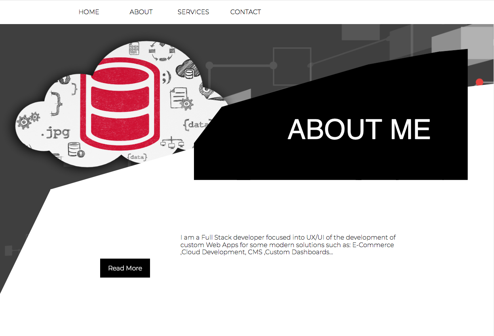

# React Server Side Rendering
React + Webpack + Express

## Demo

<a href="https://shrouded-crag-45632.herokuapp.com/">https://shrouded-crag-45632.herokuapp.com/</a>

### Home Section

### About Me Section

### Services Section

### Contact Section

## Available Scripts

In the project directory, you can run:

### `npm start`

Runs the app in the development mode. 
Open [http://localhost:3000](http://localhost:3000) to view it in the browser.

### `npm run libs`

Builds the external javascript libraries in one single file

### `npm run rebuild`

Builds the app for production to the `build` folder.  
